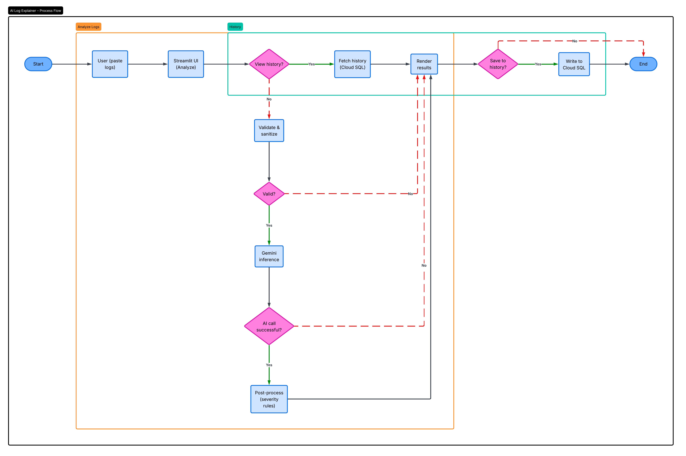
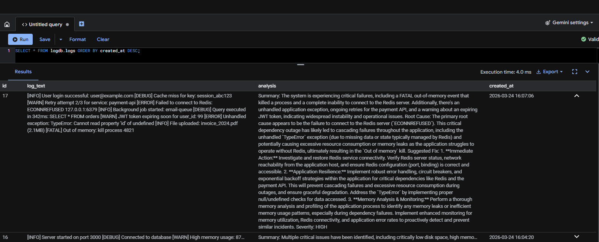
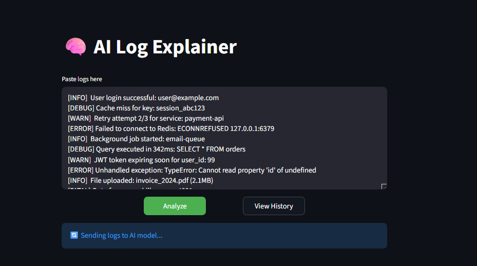
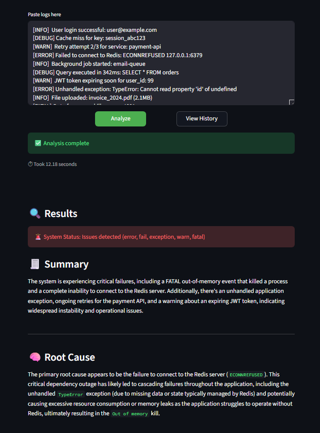
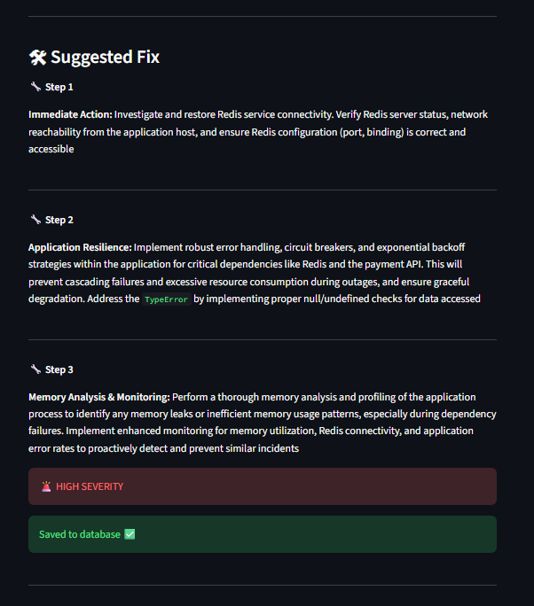
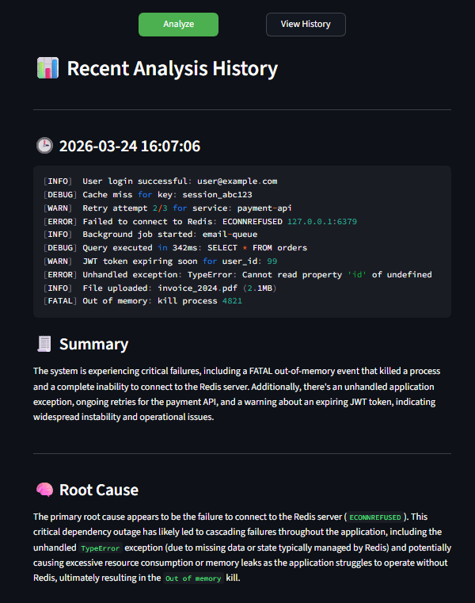

# 🧠 AI Log Explainer (Cloud-Native Log Analyzer Tool)


An AI-powered, cloud-native log analysis system that transforms raw, unstructured logs into **actionable insights** using **Google Gemini AI**.

---

## 🎬 Demo


---

## 🚀 Problem Statement

Modern systems generate massive volumes of logs that are:

- Unstructured
- Noisy
- Time-consuming to analyze
- Difficult to interpret under pressure

This project solves that by automatically interpreting logs and generating structured insights.

---

## 💡 Solution

AI Log Explainer is a **single-purpose AI agent** that:

- Analyzes logs using Gemini AI
- Extracts insights
- Outputs structured results

### 🔍 Output Format

- Summary
- Root Cause
- Suggested Fix
- Severity

---

## 🏗️ Architecture



The system follows a structured, cloud-native pipeline for analyzing logs:

1. **User Input (Analyze Logs)**  
   The user pastes raw logs into the Streamlit UI.

2. **Validation & Sanitization**  
   Logs are validated, cleaned, and size-limited to ensure safe and efficient processing.

3. **AI Inference (Gemini)**  
   Valid logs are sent to the Gemini AI model, which analyzes them using structured prompting.

4. **Post-Processing**  
   The response is refined with rule-based logic (e.g., severity classification and fallback handling).

5. **Render Results**  
   The system displays structured insights:
   - Summary  
   - Root Cause  
   - Suggested Fix  
   - Severity  

6. **History Flow (Optional Path)**  
   - Users can view previous analyses stored in Cloud SQL  
   - New analysis results can be saved to the database  

This workflow ensures **reliable, structured, and scalable AI-driven log analysis**, aligning with real-world DevOps practices.

---

## ⚙️ Tech Stack

- **Frontend:** Streamlit
- **Backend:** Python
- **AI:** Google Gemini (gemini-2.5-flash)
- **Cloud:** Cloud Run, Cloud SQL
- **Database:** SQLAlchemy, PyMySQL

---

## 🔥 Features

- AI-powered log summarization
- Root cause detection
- Step-by-step fixes
- Severity classification
- History tracking
- Rate limiting + sanitization
- Secure DB handling

---

## ⚡ Local Setup

```bash
python -m venv venv
source venv/bin/activate # Git Bash (activate python venv)
pip install -r requirements.txt
streamlit run app.py
```

```bash
# Ensure that you have created your own CLOUD SQL INSTANCE and GEMINI API key first in Google Cloud!
# Then set your configuration variables on the terminal
GEMINI_API_KEY=your_api_key_here
DB_USER=your_db_user
DB_PASSWORD=your_db_password
DB_HOST=your_db_host
DB_NAME=your_db_name
```

---

## ☁️ Deploy (Cloud Run)

```bash
gcloud run deploy ai-log-explainer --source . --region us-central1 --allow-unauthenticated --set-env-vars GEMINI_API_KEY="$GEMINI_API_KEY",DB_USER="$DB_USER",DB_PASSWORD="$DB_PASSWORD",DB_HOST="$DB_HOST",DB_NAME="$DB_NAME"

#Then use the deployment link produced after running gcloud run to use the app in your browser.
```

---

## 🧪 Usage

1. Paste logs
2. Click Analyze
3. View results
4. Check history

---

## 🗄️ Verify Saved Logs (Cloud SQL)



To confirm that log analyses are successfully stored in your Cloud SQL database, you can run the following query in the Cloud SQL Query Editor:

```sql
SELECT * FROM logs ORDER BY created_at DESC;
```

---

## 📊 Example Output

```
Summary:
Memory issue detected

Root Cause:
Possible memory leak

Suggested Fix:
1. Restart service
2. Optimize usage
3. Monitor system

Severity:
HIGH
```

---

## 📸 Screenshots

### 🖥 Main Interface



### 🔍 Analysis Results



### 🛠 Suggested Fix



### 📊 History Feature



---

## 🚀 Future Improvements

- Auth system
- API endpoints
- Monitoring dashboard
- Secret Manager integration

---

## 👨‍💻 Author

Ralph Henry L. Dominisac

---

## 📄 License

MIT LICENSE.
